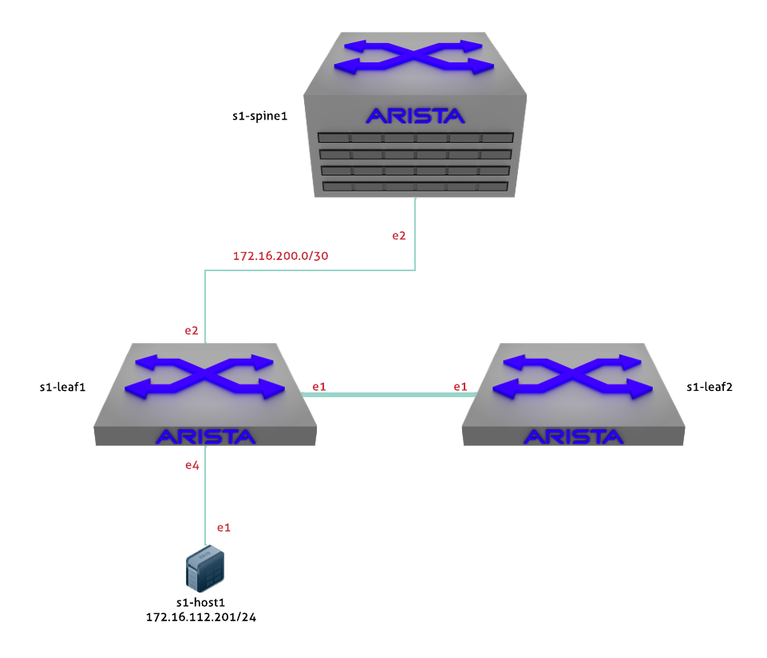

# Troubleshooting Introduction

{.align-center}

:::: note
::: title
Note
:::

A set of possible answers are available
[here](https://drive.google.com/file/d/16NJ0hKy2ZfhV4Z4fdLgcp6hBnJ_iIn9P/view?usp=sharing).
This hyperlink is only available to Arista employees. Please work with
your Arista SE for access.
::::

1.  Log into the **LabAccess** jumpserver:
    1.  Type `labs` or option `97` at the Main Menu prompt. This will
        bring up additional lab menu selections.
    2.  Type `troubleshooting-labs` or option `4` at this prompt to open
        the troubleshooting lab section (If you were previously in the
        Troubleshooting Labs Menu, you can type `back` or option `97` to
        go back).
    3.  Type `tshoot-intro` or option `1` at the prompt. The script will
        configure the lab into a errored set of states. It is up to you
        to determine a solution for each of the questions below. There
        can be many solutions, please work with your SE.
2.  Questions
    1.  Why can't s1-Leaf1 ping s1-Host1? Are there multiple ways to fix
        this?
    2.  Why is s1-Leaf2 the spanning tree root for all VLANs?
    3.  Why isn't 172.16.112.0/24 being advertised into BGP?
    4.  Why won't the OSPF adjacency come up between Leaf1 & Spine1?
