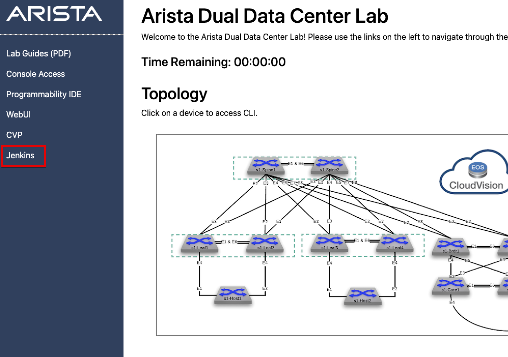
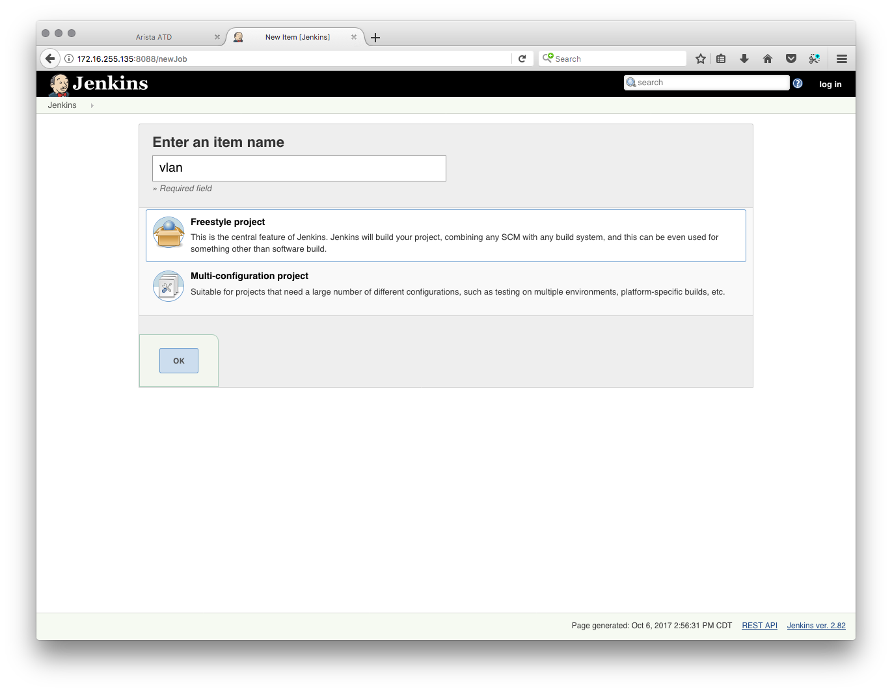
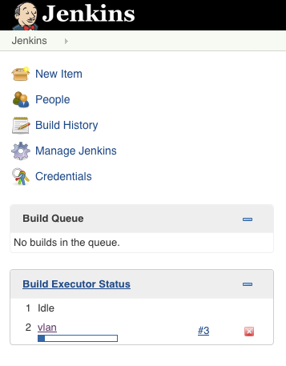
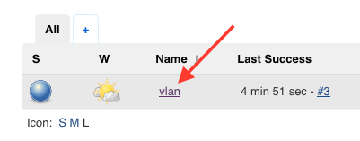
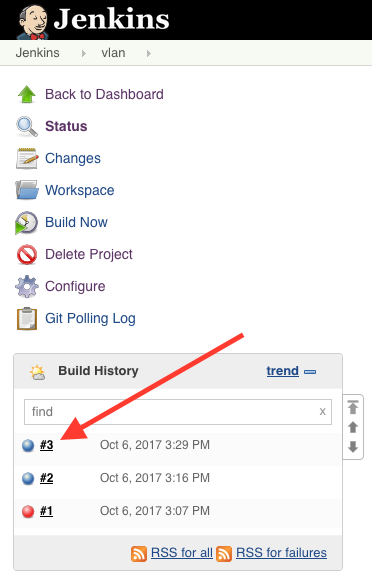

# Day 2 Operations

If you recall the earlier presentation, we mentioned Continuous
Integration and Continuous Development (CI/CD). Now we're going to show
you an example.

In this lab, we're going to go from 0-60 pretty quickly and introduce a
couple of new tools. We're also going to do things a little bit
differently - we're going to modify multiple switches simultaneously.

## Tools used in this lab

[Git](https://www.google.com/url?q=https://git-scm.com/&sa=D&ust=1523980190033000) is
the most popular version control system. If you are familiar with SVN
(Subversion) or CVS, it is a more modern and distributed system. Git
keeps your source code/configurations in a repository (repo) and
maintains a record of what changed and by whom.

:::: note
::: title
Note
:::

Git is an incredibly powerful tool. We're using shortcuts that are
specific to this lab. When using Git in production - or even just for
fun - please ensure you understand the commands you are using. Some Git
commands are destructive and irreversible!
::::

[Jenkins](https://www.google.com/url?q=https://jenkins.io/&sa=D&ust=1523980190034000) is
one of the most popular open-source automation tools with hundreds of
plugins for building/deploying/automating pretty much anything. It's not
outside the realm of possibility to have it test and push changes to
your switches and then order you a pizza if it's successful.

### Git commands

This lab makes use of a handful of git commands and the table below
describes their function:

::: cssclass
table-hover
:::

  ----------------------------------- -----------------------------------
  **Command**                         **Description**

  `git init`                          Initializes an empty git repository

  `git add`                           Adds files to the local git
                                      repository

  `git commit`                        Commits the git repository

  `git remote add origin`             Adds a remote repository to commit
                                      to

  `git push`                          Pushes code to the repository

  `git reflog`                        The git reflog command lists every
                                      commit, their checksum, their
                                      distance from the current commit,
                                      and the commit message.

  `git revert`                        Reverts the local repository to a
                                      previous commit
  ----------------------------------- -----------------------------------

## Making a change

Our tried and true "add a VLAN" task is back in full force for this lab,
but with a twist. We\'re going to set up the usual suspects - a hosts
file and a playbook, but this time we will also use group variables.
Group variables are similar to the variables defined within your
playbook in Lab #4 and #5 but can be consumed by a group of hosts, not
just the play's target.

This is particularly useful for things like adding a VLAN where you
typically want to add the VLAN to multiple devices at the same time.

### Write it

This lab is broken into steps.

#### Step #1: Hosts File

Let's start out with a different-looking hosts file, this time with
every one of your leaf switches in it. Take special note of `[leafs]`
-we'll be using this later.

Open the **Programmability IDE**, and create the file below:

``` ini
[leafs]
192.168.0.12
192.168.0.13
192.168.0.14
192.168.0.15
```

**Save** the file with the name `hosts` into the
`/home/coder/project/labfiles/lab6/lab` folder.

:::: note
::: title
Note
:::

You will notice that there are existing files and folders. Please don't
overwrite anything for this lab.
::::

#### Step #2: Playbook

The playbook is different from the other labs; we're going to call a
pre-created role that is provided by Arista on [Ansible
Galaxy](https://www.google.com/url?q=https://galaxy.ansible.com/&sa=D&ust=1523980190043000).

Ansible Galaxy is a website where individuals and organizations can
freely share their roles with each other. In this case, we'll be using
the `arista.eos.eos_vlans` module from the `arista.eos` Ansible
Collection to add VLANs.

In the **IDE**, create the file below:

``` ini
- hosts: leafs
  connection: local
  tasks:
  - name: Create vlans
    arista.eos.eos_vlans:
      config:
      - vlan_id: "{{ item.vlanid }}"
        name: "{{ item.name }}"
      state: overridden
    loop: "{{ vlans }}"
```

Save the file with the name `vlan.yml` into the
`/home/coder/project/labfiles/lab6/lab` folder.

#### Step #3: Group Variables

Now we're going to mix it up a bit. We used `vars:` in previous labs and
only acted against a single host. This time around, we will be using
what is called group variables. Group variables are used for groups of
hosts and not individuals.

Remember how in the hosts file above we started with `[leafs]`? If we
create a group variable file named `leafs.yml`, Ansible will
automagically use it for the hosts listed below `[leafs]`!

Some more things to know about the file below:

1.  Notice that we're using the Ansible Collections methodology and
    approach for this lab.
2.  `vlans`, `vlan_id`, and `name` are what the `arista.eos.eos_vlans`
    collections module take as an input. If you want to see every module
    and variable that the collection can use, see the [readme for the
    role](https://github.com/ansible-collections/arista.eos).

In the **IDE**, and create the file below:

``` ini
ansible_connection: ansible.netcommon.httpapi
ansible_httpapi_use_ssl: True
ansible_httpapi_validate_certs: False
ansible_network_os: arista.eos.eos
ansible_user: arista
ansible_password: {REPLACE_PWD}
vlans:
 - vlanid: 1001
   name: default
```

Save the file with the name `leafs.yml` into the
`/home/coder/project/labfiles/lab6/lab/group_vars` folder.

#### Step #4: Jenkins

Go back to the ATD web landing page, and click on the **Jenkins** link:

Once Jenkins has loaded, click on the **Login** link for access with:

Username: `arista` Password: `{REPLACE_PWD}`

{.align-center}

| 

Jenkins will open in a new tab. Click on **New Item** in the top left of
the window.

You will be greeted with a screen like the one below. Enter **vlan** as
the name and select **Freestyle project**.

{.align-center}

Click **OK**.

Now comes the fun part.

Under **Source Code Management**, check **Git** and enter
`/opt/labfiles/lab6/repo` in the **Repository URL** field.

:::: note
::: title
Note
:::

You will see a warning, ignore it for now.
::::

Scroll down to **Build Triggers**, and check **Poll SCM**. Poll SCM will
poll for changes in Git and trigger a build from it.

:::: note
::: title
Note
:::

This is a crucial aspect of continuous delivery - once a change is made,
this is the part that deploys it.
::::

In the **Schedule** field, enter in:

``` html
* * * * *
```

If you are familiar with Linux cron, this is the same format - it's
telling Jenkins to check every 1 minute for a change.

Scroll down to **Build** and click on **Add build step**. Select
**Invoke Ansible Playbook**.

For **Playbook path**, enter `vlan.yml`. Select **File** or **host
list** and enter in `hosts`.

Click **Save**.

#### Step #5: Git

We have to commit our changes into a Git repository for Jenkins to
detect a change and run our playbook. Let's go back to our **IDE** and
run a few of quick commands for our initial commit.

Open a **terminal** window and type:

``` bash
cd ~/project/labfiles/lab6/lab
```

First we will need to prep our \"remote\" git repository. Type the
following command:

``` bash
git init --bare /home/coder/project/labfiles/lab6/repo
```

Now enter the following:

``` bash
git init
git add .
git commit -m "Initial commit"
git remote add origin /home/coder/project/labfiles/lab6/repo
git push origin master
```

### Run it

Phew, that was a lot of setup! Fortunately, unlike previous labs, we're
not going to be running this one by hand - that wouldn't be CI/CD!
Instead We're going to use Jenkins to run the playbook.

At a high level, the workflow of the "Run it" part of the lab looks like
this:

{.align-center}

Let's start with Step 1.

#### Step #1: Add a VLAN to the variables file

Open the `leafs.yml` variables file in the **IDE**.

Add the following highlighted lines directly below the existing text:

``` ini
vlans:
 - vlanid: 1001
   name: default
 - vlanid: 2000
   name: production
 - vlanid: 3000
   name: development
```

**Save** the file.

#### Step #2: Add the file to the Git commit and push it

Now, let's add the file, commit, and push it. If you want to see it run,
we'll need to act quickly here, so get ready!

In the **terminal** window, type:

``` bash
cd ~/project/labfiles/lab6/lab
```

Now enter the following:

``` bash
git add .
git commit -m "Added VLAN 2000 and 3000"
git push origin master
```

Quickly, open Jenkins!

#### Step #3: Jenkins

You will see different things depending on how fast you switched to
Jenkins. For example, if you were quick, you will see this:

{.align-center}

See the **vlan** build running? No worries if you weren't able to see
it, Jenkins keeps a history - handy for when you want to see how things
went.

From the main screen, click on **vlan**:

{.align-center}

On the left hand side, click on the latest build which should be **#3**,
but could be a higher or lower number.

{.align-center}

In the left hand menu, click **Console Output**.  Scroll all the way to
the bottom to see:

``` html
PLAY RECAP *********************************************************************
192.168.0.12               : ok=7    changed=1    unreachable=0    failed=0    skipped=2    rescued=0    ignored=0
192.168.0.13               : ok=7    changed=1    unreachable=0    failed=0    skipped=2    rescued=0    ignored=0
192.168.0.14               : ok=7    changed=1    unreachable=0    failed=0    skipped=2    rescued=0    ignored=0
192.168.0.15               : ok=7    changed=1    unreachable=0    failed=0    skipped=2    rescued=0    ignored=0
```

Woot, sweet success!

#### Step #4: Switches are configured

Now, log into a couple of the leaf switches for the final step. Notice
the VLANs are there. Pretty cool, huh?

You can do this for 1 or 1000 switches using this playbook.
